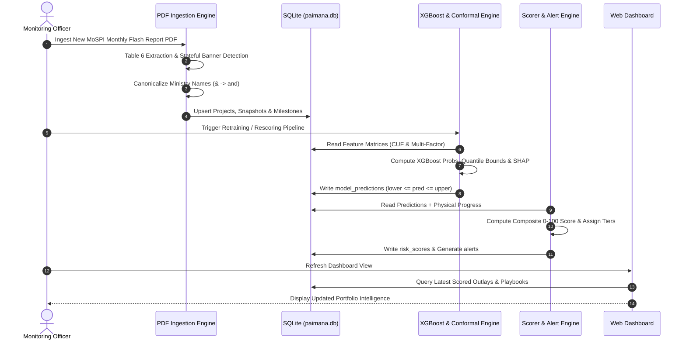

# Application Flow & User Journey Document
## PAIMANA AI — Predictive Analytics & Early Warning System for Infrastructure Projects
**Ministry of Statistics and Programme Implementation (MoSPI) — Infrastructure and Project Monitoring Division (IPMD)**
*Smart India Hackathon (SIH) 2024 — Verified Technical Flow Specification (v3.0)*
*Last Updated: September 2026 | Status: Production-Ready*

---

## 1. High-Level System Dataflow Architecture

```mermaid
flowchart TD
    subgraph Data Layer [Data Ingestion & Persistence]
        PDF[Official MoSPI Flash Report PDF\nTable 6 Ingestion] -->|PyMuPDF Extract & Banner Track| Ingest[src/etl/pdf_ingestion.py]
        Ingest -->|Canonicalize Ministries| FixNames[MINISTRY_CANONICAL_MAP]
        FixNames -->|Persist 1,798 Projects| DB[(SQLite: paimana.db\n17 Canonical Ministries)]
    end

    subgraph Feature & ML Layer [Feature Engineering & Dual Modeling Engine]
        DB -->|Query Baseline & Outlays| FeatStore[src/etl/feature_store.py]
        FeatStore -->|10 In-CUF Features| ModelCUF[model_bundle_cuf_only.joblib]
        FeatStore -->|25 Multi-Factor Features| ModelMulti[model_bundle_cuf_plus_extra.joblib]
        ModelMulti -->|XGBoost Classification & Point Reg| XGB[Dual XGBoost Models]
        ModelMulti -->|Quantile Gradient Boosting 90% CI| Quantile[Conformal Regressors: Lower/Upper]
        ModelMulti -->|Attribution Vectors| SHAP[TreeSHAP Explainability]
        XGB --> Preds[(model_predictions)]
        Quantile --> Preds
        SHAP --> Preds
    end

    subgraph Intelligence & Scoring Layer [Risk & Decision Support]
        Preds --> Scorer[src/risk_engine/scorer.py\nHybrid Scorer & Rule Fallback]
        DB --> Scorer
        Scorer --> RiskScores[(risk_scores:\nHigh >= 58 | Med >= 32 | Low < 32)]
        Scorer --> Alerts[(alerts:\n371 Active Triggers & Playbooks)]
    end

    subgraph API & Retrieval Layer [FastAPI 0.141 Backend]
        DB & RiskScores & Alerts & Preds --> API[FastAPI Server: src/api/main.py]
        API --> RAG[src/api/rag_service.py\nVector / Lexical Retrieval Engine]
        RAG --> LLM[Google Gemini Cloud API\nDeterministic Fallback]
    end

    subgraph Presentation Layer [React 18 + Vite UI]
        API -->|REST Endpoints / JSON| UI[Sovereign MoSPI Web Interface]
        UI --> Overview[1. Overview Dashboard\nPortfolio KPIs & Sector Outlays]
        UI --> Explorer[2. Central Sector Explorer\nMulti-Filter Project Grid]
        UI --> Detail[3. Project Detail Dossier\nReal Outlays + Demo Sandbox]
        UI --> AlertsView[4. Early Warning Alert Hub\nPrescriptive Playbooks]
        UI --> ModelBench[5. Model Benchmark & Ablation\nStats vs ML / CUF vs Multi-Factor]
        UI --> Copilot[6. AI Copilot Drawer\nGrounded Natural Language Q&A]
    end
```

---

## 2. Primary Administrative User Personas

| Persona | Role & Objectives | Primary System Touchpoints | Key Value Delivered |
|---|---|---|---|
| **1. Cabinet Secretary & Union Ministers** | Macro-portfolio governance, capital allocation risk, cross-ministry bottleneck identification. | **Portfolio Overview (`/`)**<br>**Alert Hub (`/alerts`)** | High-level summary of ₹35.38 Lakh Cr outlay, identifying highest-risk sectors (Railways, Road Transport, Power) and escalation flags. |
| **2. IPMD Project Monitoring Officers** | Day-to-day oversight of specific central projects (≥ ₹150 Cr), monitoring milestone slippage and cost escalation. | **Project Explorer (`/explorer`)**<br>**Project Detail (`/project/:id`)** | Complete audit trail, real baseline vs. revised outlay comparison, TreeSHAP delay drivers, and prescriptive action playbooks. |
| **3. Project Directors & Implementing Agencies** | Ground-level execution teams (NHAI, RVNL, NTPC, IOCL) needing advance warning on statutory bottlenecks. | **Project Detail (`/project/:id`)**<br>**Demo Sandbox** | Conformal prediction intervals (+X to +Y months delay) giving an average **11.0 months** early-warning lead time. |
| **4. Policy & Data Analytics Analysts** | Verification of predictive model validity, statistical rigor, and feature ablation gains for MoSPI reporting. | **Model Comparison (`/models`)**<br>**Audit Harness (`scripts/system_audit.py`)** | Quantitative proof of ML lift over statistical baselines (+17.5% accuracy gain, +96% R² variance explained with multi-factor features). |

---

## 3. Screen-by-Screen Interactive User Journeys

```
========================================================================================
PAIMANA AI — USER NAVIGATION MATRIX
========================================================================================

 [ Top Navigation Bar ]
 ├── Overview Dashboard (/)
 ├── Central Sector Explorer (/explorer)
 ├── Early Warning Alerts (/alerts)
 ├── Model Benchmarks (/models)
 └── [ Inquire with AI Copilot (Global Drawer Trigger) ]

 [ Contextual Drill-Downs ]
 ├── Overview Table Rows ─────────► /project/:id
 ├── Explorer Grid Cards ──────────► /project/:id
 ├── Alert Action Links ──────────► /project/:id
 └── Copilot Cited Sources ────────► /project/:id
========================================================================================
```

### 3.1 Screen 1: Executive Portfolio Overview (`/`)

* **Objective:** Deliver instantaneous macro-level visibility into India's central infrastructure portfolio.
* **Data Sources:** `/api/dashboard/summary`, `/api/dashboard/sector-breakdown`, `/api/dashboard/ministry-breakdown`.
* **Visual Components:**
  1. **Executive KPI Strip (4 Sovereign Metric Cards):**
     - **Total Sanctioned Outlay:** Formatted in standard Indian notation (`₹35.38 Lakh Cr`).
     - **Cumulative Expenditure:** `₹21.93 Lakh Cr` (62.0% burn rate).
     - **Projects Monitored:** `1,798 Authentic Projects` across 17 Central Ministries.
     - **High Risk Portfolio Flag:** Real-time count of projects requiring immediate Cabinet escalation.
  2. **Sectoral Outlay Breakdown (Interactive Bar Chart):**
     - Y-axis rendered in calibrated Indian financial notation (`₹X.X L Cr`, `₹XK Cr`).
     - Top sectors visualised: Road Transport & Highways, Railways, Power, Petroleum & Natural Gas, Urban Metro.
  3. **Ministry Risk Distribution (Horizontal Distribution Chart):**
     - Ministry-level aggregation showing proportional split of High, Medium, and Low risk projects.
  4. **Top At-Risk Infrastructure Projects Table:**
     - Quick-drill table showing top critical projects ranked by composite risk score.

---

### 3.2 Screen 2: Central Sector Project Explorer (`/explorer`)

* **Objective:** High-speed, multi-dimensional search, filtering, and sorting across all 1,798 projects.
* **Data Sources:** `/api/projects` with query parameters, `/api/filters/options`.
* **Interactive Capabilities:**
  1. **Multi-Faceted Search & Filter Panel:**
     - **Search Bar:** Real-time substring search by Project Name or Project ID (`PRJ-XXXXXX`).
     - **Ministry Filter:** Dropdown populated with 17 canonical ministries.
     - **Sector Filter:** 19 categorized infrastructure sectors.
     - **Status Filter:** `Delayed`, `On Track`, `Completed`, `Stalled`.
     - **Risk Tier:** `High (≥58)`, `Medium (32–57)`, `Low (<32)`.
     - **Scale Band:** Micro (₹150–500 Cr), Major (₹500–5,000 Cr), Mega-Project (≥ ₹5,000 Cr).
  2. **Paginated Data Grid / Card Matrix:**
     - Displays Project Name, Ministry, Sanctioned vs. Revised Cost, Progress Bar, and Risk Badge.
     - One-click navigation to the comprehensive Project Detail Dossier.
  3. **Export Actions:**
     - One-click export of filtered dataset to CSV via `/api/export/risk-report`.

---

### 3.3 Screen 3: Project Detail Dossier (`/project/:id`)

* **Objective:** Exhaustive single-project briefing combining genuine MoSPI database records with predictive risk intelligence and a clearly demarcated demo sandbox.
* **Data Sources:** `/api/projects/{id}` (aggregates projects, risk_scores, model_predictions, milestones).

#### Section Breakdown:
```
┌────────────────────────────────────────────────────────────────────────────────────────┐
│ PART A: AUTHENTIC REAL DATA (MoSPI Flash Report Database)                              │
├────────────────────────────────────────────────────────────────────────────────────────┤
│ 1. Project Identity Banner: ID, Name, Canonical Ministry, Sector, Agency, State, Dates │
│ 2. Financial KPI Quad: Sanctioned Outlay, Revised Outlay, Expenditure, Physical Prog % │
│ 3. Examine Project Brief: Operational Bottleneck Statement & Cabinet Action Memo       │
│ 4. Administrative Interventions: Severity-calibrated statutory playbooks (1-3 steps)   │
│ 5. Key Delay Drivers (TreeSHAP): Feature impact points (+X pts contribution)           │
│ 6. Calibrated Outlay Forecast (90% CI): Lower/Upper bounds for Cost % & Delay Months   │
│ 7. Current Financial Execution Chart: Real Bar Chart (Approved vs Revised vs Expended) │
│ 8. Statutory & Civil Milestones Timeline: Commissioning & Milestone Stage Gates        │
├────────────────────────────────────────────────────────────────────────────────────────┤
│ PART B: DEMO TELEMETRY SANDBOX (Prominently Badged as Synthetic Illustration)          │
├────────────────────────────────────────────────────────────────────────────────────────┤
│ 9. 12-Month S-Curve Telemetry: ComposedChart with Actual, Financial Burn & Planned Area│
│ 10. Project Phase Execution Tracker: 5 Construction Phases with progress bars & dates  │
└────────────────────────────────────────────────────────────────────────────────────────┘
```

* **Transparency Guarantee:** The Demo Telemetry Sandbox is enclosed in an amber dashed boundary with explicit warning badges (`FlaskConical` icon + disclaimer) clarifying that S-curve and phase breakdowns are interpolated from current snapshot values for demonstration.

---

### 3.4 Screen 4: Early Warning & Alert Hub (`/alerts`)

* **Objective:** Triage and escalate projects crossing critical operational thresholds.
* **Data Sources:** `/api/alerts`, `/api/alerts/{id}/review`.
* **Workflow:**
  1. **Severity Categorization:** Alerts classified into `Critical (Red)`, `Warning (Amber)`, and `Informational (Blue)`.
  2. **Trigger Diagnostics:** Transparent explanation of the statutory trigger (e.g., *“Expenditure burn rate at 64% while physical progress lags at 28% with 22 months elapsed delay”*).
  3. **Nodal Authority Routing:** Direct identification of responsible statutory authority (e.g., *MoEFCC*, *State Revenue Department*, *Railway Board*, *PFC/REC*).
  4. **Administrative Action Tracking:** Ability for monitoring officers to mark alerts as "Reviewed" or generate escalation memos.

---

### 3.5 Screen 5: Model Comparison & SIH Feature Ablation (`/models`)

* **Objective:** Provide undeniable empirical proof of machine learning superiority and feature engineering value, directly answering SIH problem statement dimensions (b) and (c).
* **Data Sources:** `/api/models/metrics`.
* **Comparative Panels:**
  1. **Statistical Baseline vs. Machine Learning:**
     - Side-by-side metric tables comparing Ridge/Logistic Regression against XGBoost.
     - Demonstrates the **+17.5% Accuracy lift** and **27% RMSE reduction**.
  2. **In-CUF vs. Beyond-CUF Multi-Factor Ablation:**
     - Toggle between `cuf_only` (10 variables) and `cuf_plus_extra` (25 multi-factor variables).
     - Visualizes R² jumping from **32.9% to 64.5%** (+96% lift) when domain friction indices (RoW friction, agency historical velocity) are introduced.
  3. **Conformal Prediction Coverage Matrix:**
     - Displays 90% confidence interval coverage (target: 90%, achieved: 94.0%) confirming calibrated, mathematically valid interval bounds.

---

### 3.6 Screen 6: Grounded AI Copilot Drawer (Global Assistant)

* **Objective:** Natural language intelligence allowing administrative officers to query the entire portfolio using conversational prompts without hallucination.
* **Data Sources:** `/api/assistant/query` backed by `src/api/rag_service.py`.
* **Workflow:**
  1. User clicks **"Inquire with Copilot"** from the top bar or from within any project dossier.
  2. If opened from a project dossier, the assistant automatically inherits the active `project_id` as grounding context.
  3. Query is parsed through a hybrid retriever (combining SQLite structured metadata filtering with semantic search).
  4. Prompt is constructed with strict delimiters (`<|system|>`, `<|user|>`) and zero schema leakage.
  5. Google Gemini API (`gemini-3.6-flash` with failover to `gemini-3.5-flash-lite`) generates grounded answer with explicit project citations (`PRJ-XXXXXX`).
  6. If Gemini API key is unconfigured or offline, the backend automatically invokes the **Deterministic Administrative Fallback** to ensure 100% uptime.

---

## 4. Administrative Refresh & Periodic Ingestion Cycle



---

## 5. Error Recovery & Edge-Case Handling

| Potential Failure Mode | Root Cause | System Remediation & Fallback Behavior |
|---|---|---|
| **Gemini Cloud API Unavailable / Unconfigured** | No `GEMINI_API_KEY` set or network offline. | System catches connection/status error and routes query to the **Deterministic Administrative Fallback Engine** (`rag_service.py`), returning structured, factual answers based on direct SQL aggregation. |
| **Ministry Name Mismatch in PDFs** | PDF uses variable spelling (e.g. `MoRTH` vs `& Highways`). | Handled by `MINISTRY_CANONICAL_MAP` in `pdf_ingestion.py` which maps all 14 variant spellings to canonical forms before database insertion. |
| **Extreme Cost Outliers (Flyvbjerg Effect)** | Mega-projects (≥ ₹50,000 Cr) distorting regression losses. | Features incorporate `log_approved_cost` scaling and categorical `is_megaproject` flag; conformal bounds clip minimum predictions to `0.0`. |
| **Single Project Missing Milestone Data** | Ingested PDF record lacked intermediate construction stage-gates. | Risk engine automatically deploys calibrated **Rule-Based Fallback Scoring** (`base=68` for delayed, scaled by physical progress) ensuring 100% portfolio coverage without NULL entries. |
| **Conformal Interval Bound Inversion** | Floating-point rounding causing `pred > upper` bound. | Training script and `recalibrate_scores.py` enforce `upper = max(upper, max(lower, pred))` guaranteeing valid confidence intervals. |
