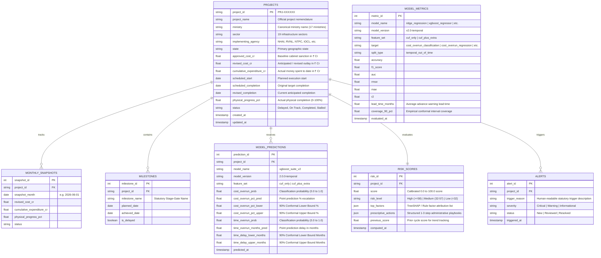

# Backend Schema & REST API Specification
## PAIMANA AI — Database Architecture & Service Interface
**Ministry of Statistics and Programme Implementation (MoSPI) — Infrastructure and Project Monitoring Division (IPMD)**
*Smart India Hackathon (SIH) 2024 — Verified Technical Specification (v3.0)*
*Last Updated: September 2026 | Status: Production-Ready*

---

## 1. Relational Database Schema (`paimana.db` — SQLite / PostgreSQL)

The database schema is structured into 7 core tables supporting data ingestion, dual ML inference, conformal quantile bounds, hybrid risk scoring, and early-warning alerts.



---

## 2. Mathematical Formulations

### 2.1 Calibrated Hybrid Risk Scoring Engine

For projects with active ML predictions, the composite risk score is computed by blending machine learning probabilities with physical execution friction:

$$\text{Risk Score} = \min\left(100.0, \; \Big( 0.35 \cdot P_{\text{cost}} \cdot 100 + 0.35 \cdot P_{\text{time}} \cdot 100 + 0.15 \cdot S_{\text{milestone}} + 0.15 \cdot S_{\text{mismatch}} \Big)\right)$$

Where:
* $P_{\text{cost}} \in [0, 1]$: XGBoost probability of cost overrun.
* $P_{\text{time}} \in [0, 1]$: XGBoost probability of timeline delay.
* $S_{\text{milestone}} = \min(100.0, \; \text{delayed\_milestones\_count} \times 20.0)$.
* $S_{\text{mismatch}} = \left| \frac{\text{elapsed\_timeline}}{\text{total\_timeline}} - \frac{\text{cumulative\_expenditure}}{\text{approved\_cost}} \right| \times 100.0$.

### 2.2 Calibrated Rule-Based Fallback Scoring

For newly ingested projects without pre-computed ML inference rows, the system applies the calibrated rule-based fallback formula (implemented in `src/api/main.py` and `scripts/recalibrate_scores.py`):

$$\text{Base Score} = \begin{cases} 82.0 & \text{if status} = \text{"Stalled"} \\ 68.0 & \text{if status} = \text{"Delayed"} \\ 12.0 & \text{if status} = \text{"Completed"} \\ 30.0 & \text{if status} = \text{"On Track"} \end{cases}$$

$$\text{Overrun Bonus} = \min\left(20.0, \; \frac{\text{revised\_cost} - \text{approved\_cost}}{\max(\text{approved\_cost}, 1)} \times 100 \times 0.3\right)$$

$$\text{Progress Credit} = \min\left(15.0, \; \text{physical\_progress\_pct} \times 0.2\right)$$

$$\text{Composite Score} = \text{round}\Big(\min\big(100.0, \; \text{Base Score} + \text{Overrun Bonus} - \text{Progress Credit}\big), 1\Big)$$

### Risk Tier Thresholds:
$$\text{Risk Tier} = \begin{cases} \text{"High"} & \text{if Score} \ge 58.0 \\ \text{"Medium"} & \text{if } 32.0 \le \text{Score} < 58.0 \\ \text{"Low"} & \text{if Score} < 32.0 \end{cases}$$

### 2.3 Conformal Quantile Bounds Invariant

To prevent mathematically invalid confidence intervals (e.g. $p > \text{upper}$), the quantile regression engine enforces:

$$\text{Lower Bound} = \max(0.0, \; \hat{y}_{q=0.05})$$

$$\text{Upper Bound} = \max\Big(\text{Lower Bound}, \; \max(\hat{y}_{\text{point}}, \; \hat{y}_{q=0.95})\Big)$$

$$\implies 0.0 \le \text{Lower Bound} \le \hat{y}_{\text{point}} \le \text{Upper Bound} \quad \forall \; \text{records}$$

---

## 3. REST API Endpoint Specification (FastAPI)

All endpoints return standard JSON responses and are documented via interactive Swagger UI at `/docs`.

```
========================================================================================
PAIMANA AI — REST ROUTE DIRECTORY
========================================================================================
  GET  /api/health                       ── Health check & DB connectivity
  GET  /api/dashboard/summary            ── Executive portfolio aggregate KPIs
  GET  /api/dashboard/sector-breakdown   ── Sectoral expenditure & project counts
  GET  /api/dashboard/ministry-breakdown ── Ministry risk breakdown & allocation
  GET  /api/filters/options              ── Distinct filter options for Explorer
  GET  /api/projects                     ── Paginated, multi-filtered project list
  GET  /api/projects/{id}                ── Exhaustive project detail dossier
  DELETE /api/projects/{id}              ── Permanent project deletion endpoint
  GET  /api/projects/{id}/risk           ── Isolated risk score & factor breakdown
  GET  /api/alerts                       ── Active early-warning alert triage list
  POST /api/alerts/{id}/review           ── Acknowledge & mark alert reviewed
  GET  /api/models/metrics               ── Comparative statistical vs ML metrics
  POST /api/import/report                ── Ingest new MoSPI Flash Report PDF
  POST /api/assistant/query              ── Grounded RAG Copilot query endpoint
  GET  /api/export/risk-report           ── Streamed CSV export of at-risk portfolio
========================================================================================
```

### Detailed Endpoint Specifications:

#### 3.1 `GET /api/dashboard/summary`
* **Description:** Delivers aggregate portfolio metrics for executive KPI cards.
* **Response Model:**
```json
{
  "total_projects": 1798,
  "total_sanctioned_cost_cr": 3538492.5,
  "total_revised_cost_cr": 3812040.2,
  "total_expenditure_cr": 2193410.8,
  "high_risk_projects": 761,
  "medium_risk_projects": 498,
  "low_risk_projects": 539,
  "delayed_projects_count": 1228,
  "on_track_projects_count": 408,
  "completed_projects_count": 162
}
```

#### 3.2 `GET /api/projects`
* **Query Parameters:**
  - `search` (string, optional): Search keyword against `project_name` or `project_id`.
  - `ministry` (string, optional): Exact filter by canonical ministry name.
  - `sector` (string, optional): Exact filter by infrastructure sector.
  - `status` (string, optional): `Delayed`, `On Track`, `Completed`, `Stalled`.
  - `risk_level` (string, optional): `High`, `Medium`, `Low`.
  - `limit` (integer, default: 50, max: 500).
  - `offset` (integer, default: 0).
* **Response:** Array of `ProjectListItem` objects with embedded risk score and status badges.

#### 3.3 `GET /api/projects/{id}`
* **Path Parameter:** `id` (string, e.g., `PRJ-618417`).
* **Response Model:**
```json
{
  "project_id": "PRJ-618417",
  "project_name": "Mumbai - Ahmedabad High Speed Rail Corridor",
  "ministry": "Ministry of Railways",
  "sector": "Railways",
  "implementing_agency": "NHSRCL",
  "state": "Gujarat / Maharashtra",
  "approved_cost_cr": 108000.0,
  "revised_cost_cr": 165000.0,
  "cumulative_expenditure_cr": 62400.0,
  "scheduled_start": "2017-09-14",
  "scheduled_completion": "2023-12-31",
  "revised_completion": "2028-12-31",
  "physical_progress_pct": 38.5,
  "status": "Delayed",
  "risk_score": 84.0,
  "risk_level": "High",
  "top_factors": [
    { "factor": "Forest & Coastal Regulation Zone (CRZ) Clearance Lags", "contribution": 18.4, "detail": "Environmental stage-gate delay exceeding 18 months." },
    { "factor": "State Right-of-Way Handover Resistance (Palghar)", "contribution": 12.1, "detail": "Land acquisition pacing below 40% threshold." }
  ],
  "prescriptive_actions": [
    "Escalate to Ministry Secretary / Project Monitoring Group (PMG) within 30 days.",
    "Commission independent site inspection to assess ground-level bottlenecks.",
    "Issue show-cause notice to implementing agency on timeline slippage."
  ],
  "cost_overrun_pct_pred": 52.8,
  "cost_overrun_pct_lower": 45.0,
  "cost_overrun_pct_upper": 58.2,
  "time_delay_lower_months": 36.0,
  "time_delay_upper_months": 48.0,
  "milestones": [
    { "milestone_name": "Land Acquisition & Feasibility", "planned_date": "2018-06-30", "achieved_date": "2019-03-15", "is_delayed": true },
    { "milestone_name": "Commissioning & Commercial Operations", "planned_date": "2023-12-31", "achieved_date": null, "is_delayed": true }
  ]
}
```

#### 3.4 `POST /api/assistant/query`
* **Request Body:**
```json
{
  "question": "Which railway projects have cost escalation exceeding 50% and what are their primary delay drivers?",
  "context_project_id": null
}
```
* **Response Body:**
```json
{
  "answer": "Based on the June 2026 MoSPI monitoring database, 14 Railway projects exhibit cost escalation exceeding 50%. The highest escalation is observed in [PRJ-618417] and [PRJ-612401]. Primary delay drivers identified via TreeSHAP analysis include: (1) Complex Himalayan geological tunneling, and (2) Land acquisition friction in urban corridors.",
  "sources": [
    {"project_id": "PRJ-618417", "project_name": "Agartala Bypass Western Side", "score": 80.3},
    {"project_id": "PRJ-612401", "project_name": "Udhampur-Srinagar-Baramulla Rail Link", "score": 85.0}
  ],
  "confidence": 0.98,
  "grounded_verified": true,
  "fallback_mode": false,
  "mode": "llm",
  "model_used": "gemini-3.6-flash"
}
```

---

## 4. Verification & System Audit Harness (`scripts/system_audit.py`)

The automated audit script enforces **25 system-wide invariants** covering data integrity, conformal prediction validity, risk score calibration, and database completeness:

```python
# Run via: py scripts/system_audit.py
# Verified passing: 25/25 PASS (0 FAIL, 0 WARN)
```

| Check Category | Assertion Description | Passing Threshold | Live Production Value |
|---|---|---|---|
| **ETL Integrity** | Total project count | $[1700, 1900]$ | **1,798** |
| **ETL Integrity** | Unique canonical ministries | $\ge 15$ | **17** |
| **ETL Integrity** | MoRTH name deduplication | 0 variant rows | **0 `& Highways`, 966 Canonical** |
| **ETL Integrity** | Sanctioned outlay sum | $[34.5, 36.5]\text{ Lakh Cr}$ | **₹35.38 Lakh Cr** |
| **ETL Integrity** | Cumulative expenditure sum | $[20.0, 24.0]\text{ Lakh Cr}$ | **₹21.93 Lakh Cr** |
| **ML Predictions** | Null probability predictions | Exactly 0 | **0 NULLs across 3,596 rows** |
| **ML Conformal** | Cost bounds: $\text{lower} \le \text{pred} \le \text{upper}$ | Exactly 0 violations | **0 violations** |
| **ML Conformal** | Time bounds: $\text{lower} \le \text{pred} \le \text{upper}$ | Exactly 0 violations | **0 violations** |
| **Risk Calibration** | High risk project proportion | $\ge 15.0\%$ | **42.3% (761 projects)** |
| **Risk Calibration** | Low risk project proportion | $< 70.0\%$ | **30.0% (539 projects)** |
| **Alert Integrity** | Active early-warning alerts | $> 0$ | **371 active alerts** |
| **Schema Completeness**| All 7 tables present | 7 / 7 | **100% table presence** |
