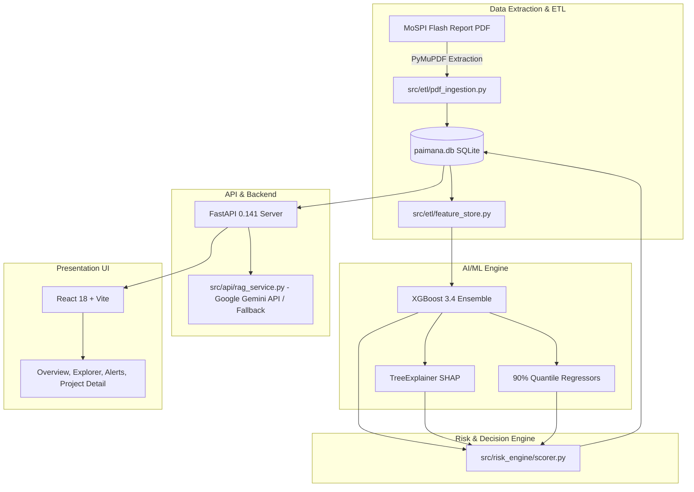

# Architecture & Data Flow
## PAIMANA AI

This document serves as the high-level map of the system integrations, module boundaries, and API structures. 

For detailed technical requirements, see `01_TRD.md`. For schema details, see `04_Backend_Schema.md`. For frontend state flows, see `02_App_Flow.md`.

## 1. High-Level Component Architecture

## 2. Directory & Module Boundaries

- `src/etl/`: Responsible exclusively for data ingestion, cleaning, and feature engineering. Does not make API calls.
- `src/models/`: Responsible exclusively for ML model training, evaluation, and serialized model artifact generation (.joblib).
- `src/risk_engine/`: Responsible for applying deterministic heuristics and ML probabilities to generate risk scores and alerts.
- `src/api/`: The FastAPI layer serving the web frontend. Contains RAG logic.
- `frontend/src/`: React frontend. Contains no direct database connection logic; relies entirely on `/api` endpoints.

## 3. Third-Party Integrations
- **Google Gemini API**: Cloud LLM integration (`GEMINI_API_KEY`, using Google AI Studio free tier models such as `gemini-3.6-flash` with automatic failover to `gemini-3.5-flash-lite`) for grounded conversational project intelligence. Automatically falls back to deterministic templates if offline or unconfigured.
- **PyMuPDF**: Native PDF parsing engine used for layout-aware table extraction (Table 6 of MoSPI reports).
